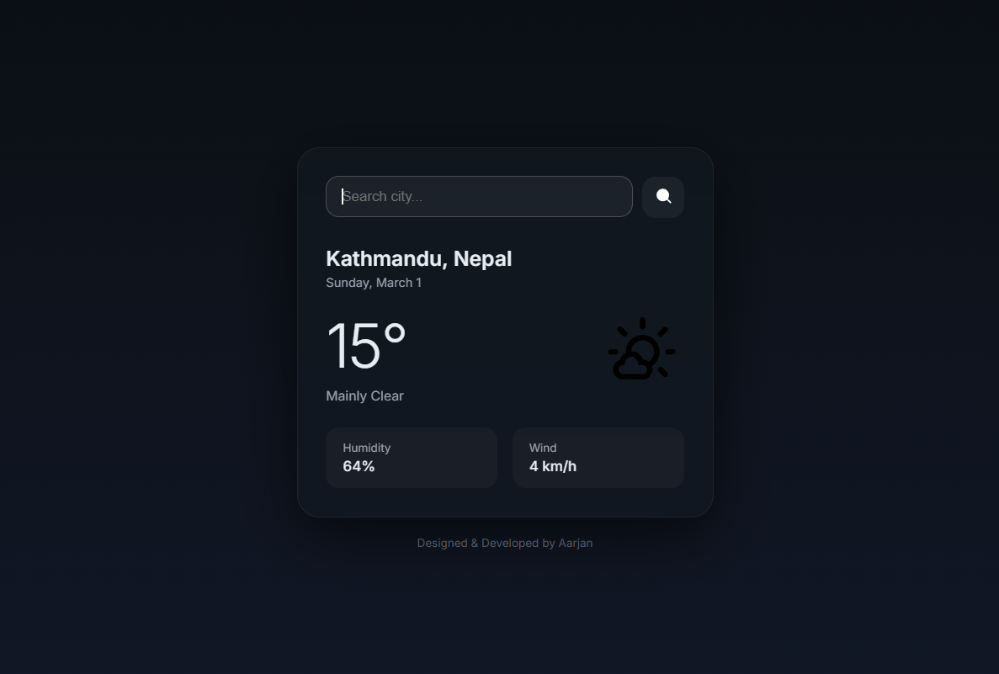

# 🌦 WeatherNow

A modern weather application that provides real-time weather data and forecasts for any city worldwide using a public weather API.

---

## 🛠 Tech Stack

**Frontend**
- HTML5
- CSS3
- JavaScript

**API**
- Open-Meteo API / OpenWeatherMap API

**Tools**
- Git & GitHub
- VS Code

---

## ✨ Features

- 🔍 City-based weather search
- 🌡 Current temperature display
- 💧 Humidity indicator
- 🌬 Wind speed information
- 📅 7-day forecast
- 📱 Fully responsive design
- ⚡ Fast API integration

---
