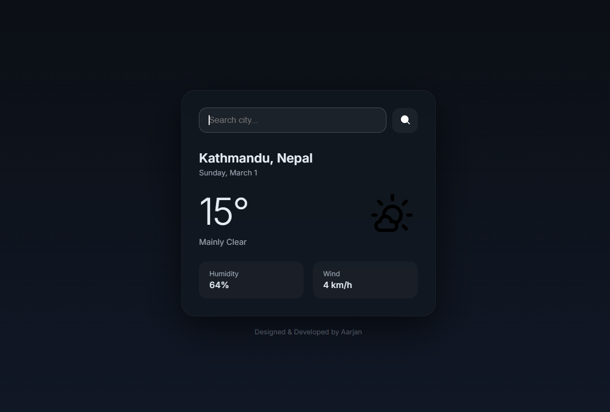

---
## Technology Stack

| Layer           | Technology         |
| --------------- | ------------------ |
| Markup          | HTML5              |
| Styling         | CSS3               |
| Language        | JavaScript (ES6+)  |
| Data Source     | OpenWeather API    |
| Version Control | Git & GitHub       |
| Development     | Visual Studio Code |

---

## Overview

Weather is a lightweight web application that provides real-time weather conditions and forecasts for locations worldwide. It combines a clean user interface with live weather data to deliver essential meteorological information in an accessible and responsive experience.

The application is designed around simplicity, allowing users to quickly search for a city and view current weather conditions without unnecessary complexity.

---

## Core Features

### Real-Time Weather

Retrieve up-to-date weather conditions, including temperature, humidity, wind speed, atmospheric pressure, and visibility.

### City Search

Search weather information for cities around the world with instant results.

### Current Conditions

View detailed weather metrics including temperature, weather description, feels-like temperature, and cloud coverage.

### Dynamic Weather Icons

Display weather-specific icons based on live atmospheric conditions.

### Responsive Interface

Optimized for desktop, tablet, and mobile devices with a consistent user experience across screen sizes.

### Lightweight Experience

Built using vanilla HTML, CSS, and JavaScript without external frontend frameworks, resulting in fast load times and minimal overhead.

---

## Weather Data

Weather information is retrieved in real time through the OpenWeather API, providing current atmospheric conditions and location-specific weather data.

---

## Project Structure

```text
.
├── index.html
├── style.css
├── script.js
├── assets/
└── README.md
```

---

## Getting Started

Clone the repository.

```bash
git clone https://github.com/AarjanAdhikari/weather-app.git
```

Navigate to the project directory.

```bash
cd <repository-name>
```

```javascript
const API_KEY = "https://api.open-meteo.com/v1/forecast?latitude=${lat}&longitude=${lon}&current_weather=true&hourly=relative_humidity_2m&timezone=auto";
```

Launch the application using a local development server such as **VS Code Live Server**, or simply open `index.html` if no server is required.

---

## Configuration

Create an account with OpenWeather and generate an API key.

Replace the placeholder API key in the project with your own credentials to enable live weather data.

---

## Performance

The application minimizes external dependencies and performs lightweight API requests to provide a fast and responsive browsing experience while maintaining a simple codebase.

---

## Browser Compatibility

* Google Chrome
* Microsoft Edge
* Mozilla Firefox
* Safari

---

## Design Principles

* Clean interface
* Fast interactions
* Responsive layouts
* Minimal dependencies
* Maintainable code organization
* Simple user experience
